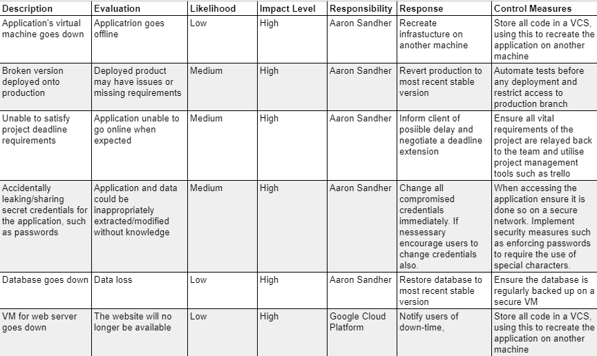
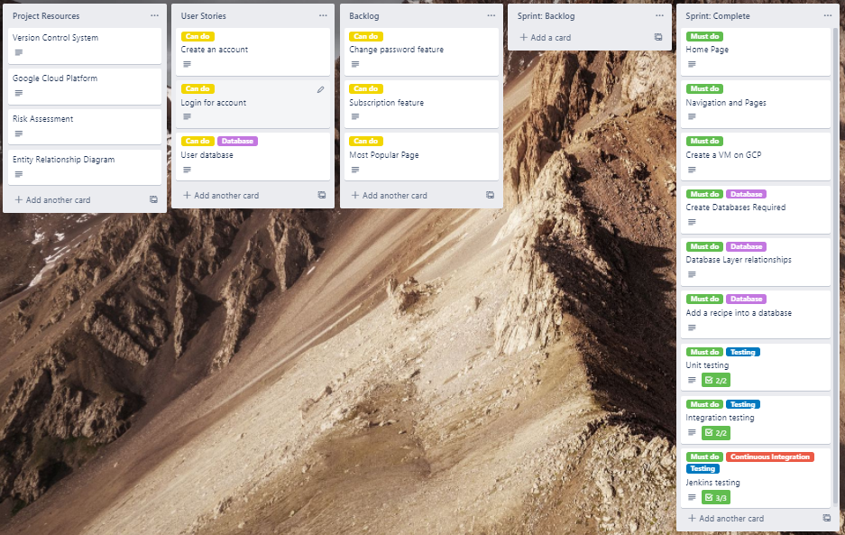
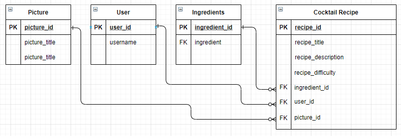
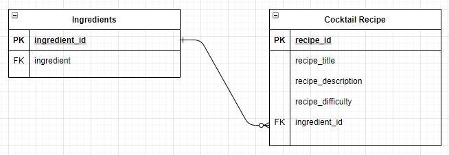
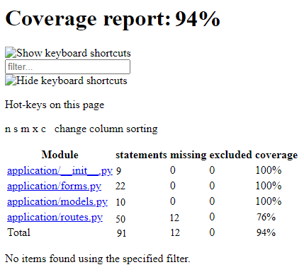

# Cocktail Club

## Contents
* [Introduction](#Introduction)
* [Design](#Design)
    * [Risk Assessment](#Risk-Assessment)
    * [Trello Board](#Trello-Board)
    * [Entity Relationship Diagram](#Entity-Relationship-Diagram)
    * [Continuous Integration](#Continuous-Integration)
* [Development](#Development)
    * [Testing](#Testing)
* [Conclusion](#Conclusion)

---
## __Introduction__

This project aims to incorporate the tools, methodologies and technologies covered during training. 

To satisfy the MVP the project must inlude trhe following:

* A trello board with user stories, uses cases and tasks needed to complete the project.
* A relational database to store data for the project, with a minimum of 2 tables with a relationship betweeen them
* Architecture for the design of the project, which must include clear documentation and a detailed Risk Assessment.
* A functional CRUD application using Python.
* Automated tests.
* A functioning front end-website, and integrated APIs using Flask.
* Full integration with a VCS, allowing a build through a CI server for deployment on a cloud platform.

## __Design__

### __Risk Assessment__
A risk assessment for the project was preformed in order to mitigate any potential risks that may occur during the project.

### __Trello Board__
A Trello board was used to organise, prioritize and monitor tasks of the project.

### __Entity Relationship Diagram__

Seen below is the initial ERD for the project.

Upon review a simpler ERD was designed to ensure that the project specification was met before expanding the database. 
The updated ERD can be seen below:

---
### __Continuous Integration__

The diagram below oultines the CI for the application. Jenkins is a CI server which carries out automated tests utilising a GitHub webhook.

## __Development__

### __Testing__

Seen below is a coverage report, which was provided by Jenkins. 

